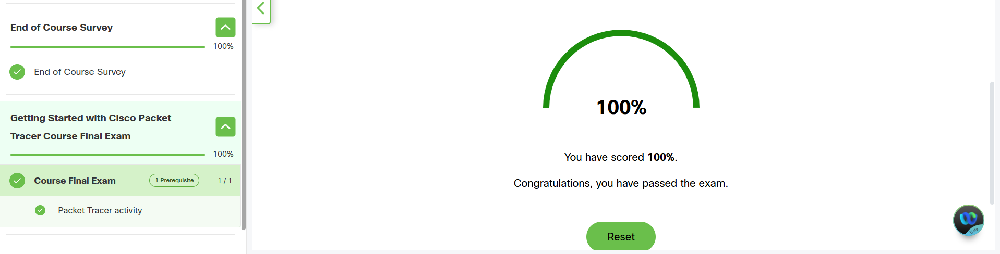
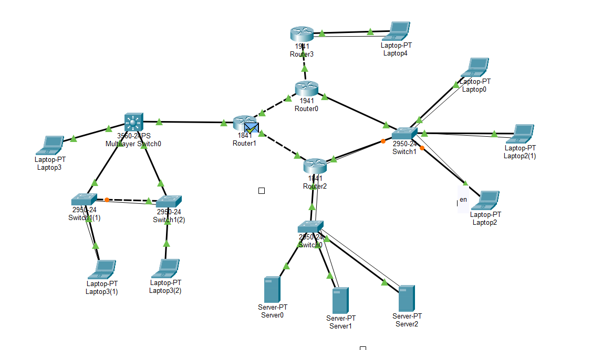
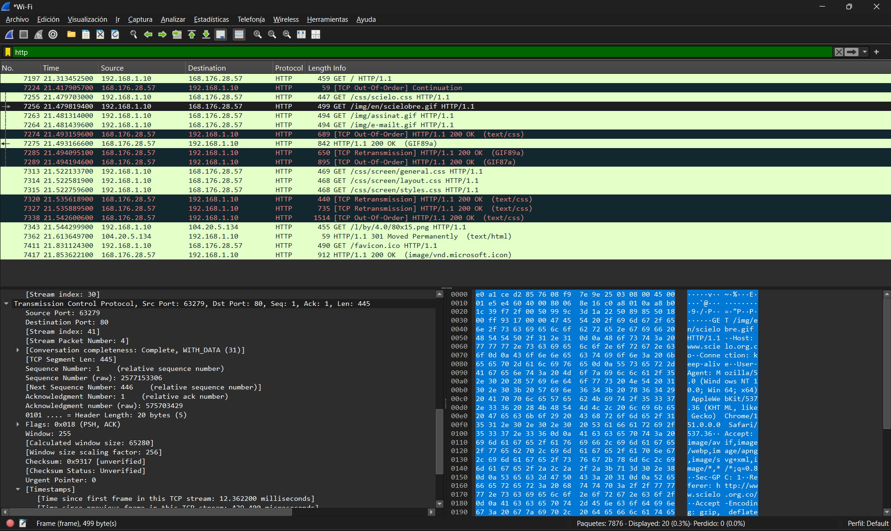
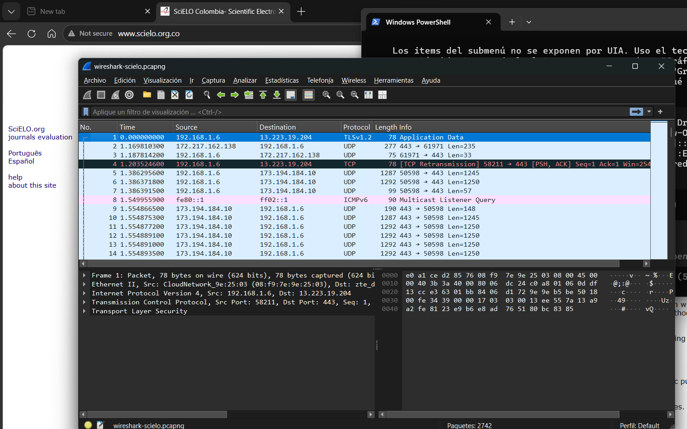
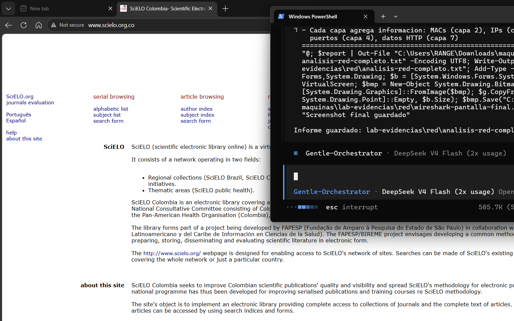
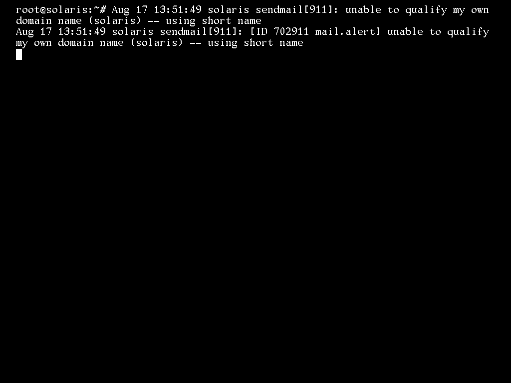

# Laboratorio No. 02 — OS Setup, Shell y Software de Soporte de Red

**Por:** Camilo Aguirre, Juan David Rangel
**Profesor:** John Alexander Pachón Pinzón
**Escuela Colombiana de Ingeniería Julio Garavito** — Arquitectura y Servicios de Red (AYSR)
**Bogotá, D.C., viernes 21 de agosto de 2026**

> Nota de esta versión (LABORATORIO CAM): este documento reproduce el informe consolidado
> del grupo (`latex/informe-latex/informe-laboratorio-02.{tex,pdf}`, rama `juan`) sin alterar
> su estructura ni la información ya verificada, y agrega lo que faltaba completar. Donde una
> sección requiere evidencia real que todavía no existe (capturas, datos de dispositivos), se
> marca explícitamente como **PENDIENTE** en vez de inventar contenido — para no meter datos
> falsos en un informe académico.

---

## 1. Introducción

Objetivo del laboratorio: familiarizarse con el software de soporte de red — Packet Tracer y
Wireshark —, con la programación de scripts de shell, con el editor VI y con el despliegue de
máquinas virtuales y compartición de archivos con SMB/SAMBA, sobre la plataforma de sistemas
operativos montada en el Laboratorio 01.

Este informe es autosuficiente: toda la evidencia (capturas, comandos y salidas reales de
ejecución) está incluida dentro del propio documento. Los videos de evidencia están publicados
en YouTube y se enlazan en la sección correspondiente y en el Anexo A.

## 2. Marco teórico

### 2.1 Packet Tracer
Packet Tracer es un simulador de redes de Cisco que permite armar topologías, configurar
dispositivos y observar el tráfico paquete por paquete en modo simulación. El curso introductorio
de la plataforma ("Getting Started with Cisco Packet Tracer") presenta los dispositivos de red,
los modos de operación y el análisis de PDUs.

### 2.2 Encapsulación
Cada capa del modelo OSI/TCP-IP agrega su encabezado a los datos de la capa superior: los datos
de aplicación se encapsulan en un mensaje ICMP/TCP, este en un paquete IP y este en una trama
Ethernet. En el destino se desencapsula en orden inverso. Esto se observa tanto en Packet Tracer
(PDUs) como en Wireshark (tráfico real).

### 2.3 Wireshark
Wireshark es un analizador de protocolos (sniffer) que captura los paquetes de una interfaz de
red y los decodifica capa por capa. En modo promiscuo, la NIC captura todas las tramas del
segmento, no solo las dirigidas a su propia MAC.

### 2.4 SMB / SAMBA
SMB (Server Message Block) es el protocolo de compartición de archivos e impresoras en redes
Windows. SAMBA es la implementación libre que permite a sistemas Unix actuar como servidores o
clientes SMB. Solaris 11.4 incluye un servidor SMB nativo gestionado por SMF y el paquete
`service/network/samba` para el servicio clásico.

### 2.5 Scripts de shell y editor VI
El shell de Unix permite automatizar tareas de administración mediante scripts. VI es el editor
de texto estándar de los sistemas Unix, con modos de operación (normal/inserción/comando).

## 3. Desarrollo

### 3.1 1. Getting to Know Packet Tracer

**Versión de Packet Tracer en la plataforma Cisco:** `9.0.1` (disponible en NetAcad).

**Video resumen del curso (capítulos 1–4, máx. 5 min):** participan los dos integrantes.
Duración: 3:42.
- Enlace: <https://youtu.be/RGuyiOb2aH4>

**Quiz "Introduction to Packet Tracer - PT Basics Quiz" (individual):**

> **⚠️ PENDIENTE:** el enunciado exige que **cada integrante** rinda el quiz individualmente.
> Solo hay evidencia de Juan David. Falta que Camilo rinda el quiz "PT Basics Quiz" y guarde su
> propio screenshot del resultado antes de entregar.

**Diagrama de red en Packet Tracer (individual):** topología con 3 routers (Router0 1941,
Router1 1841, Router2 1841), switches y servidores, con enlaces Ethernet y un enlace serial
entre routers.

Archivos entregados:
- `maquinas/lab-evidencias/pt/diagrama-camilo-final.pkt` (Camilo)
- `maquinas/lab-evidencias/pt/diagrama-juan-primer-paso.pkt` (Juan David)

> **⚠️ PENDIENTE:** verificar, abriendo cada `.pkt` en Packet Tracer, que **todos los links
> queden en estado Up** (en la versión de Juan David, los enlaces de Router2 habían quedado
> *Down*). No se puede confirmar este punto sin abrir la simulación real.

**Esquema de direccionamiento aplicado:**
- WAN R0–R1: `7.0.0.0/30` (R0=.1, R1=.2)
- WAN R1–R2: `8.0.0.0/30` (R1=.1, R2=.2)
- LAN Router0 VLAN10: `10.0.10.0/24` (gw 10.0.10.1; Server0 .10, Server1 .11, Switch1 .2)
- LAN Router0 VLAN30: `10.0.30.0/24` (gw 10.0.30.1)
- LAN Router2: `10.0.20.0/24` (gw 10.0.20.1; Server2 .10)

**Respuestas conceptuales:**
- **Conexiones negras sólidas:** enlaces físicos Ethernet directos (cable de cobre) entre
  dispositivos; la conexión de capa física real que transporta tramas (L1/L2).
- **Conexiones negras punteadas:** conexiones lógicas o virtuales; no hay un cable físico
  directo, representan una relación lógica entre dispositivos (ruta a través de la red, enlace
  inalámbrico o un enlace que aún no está activo).
- **Cable serial Router0–Router2:** cable Serial DCE/DTE (rojo) entre los puertos seriales de
  los routers; el extremo DCE define el clock rate.

### 3.2 2. Tracking Messages with Packet Tracer

**Simulación: ping desde RADIUS hacia DHCP.** Con la topología armada y las IPs configuradas, se
activa el modo *Simulation* (abajo a la derecha), se filtran los protocolos **ICMP** y **ARP**
en *Edit Filters*, y desde la consola del servidor RADIUS se ejecuta un `ping` a la IP del
servidor DHCP.

> **⚠️ PENDIENTE — esta sección NO se ha ejecutado todavía sobre la simulación real.** Lo que
> sigue es la secuencia **esperada** (marco teórico de qué debería observarse), tal como está
> preparado en `maquinas/PT-LAB02-SECCION2.md`. Antes de entregar falta:
> 1. Abrir `diagrama-camilo-final.pkt`, activar Simulation mode y filtrar ICMP + ARP.
> 2. Ejecutar `ping <IP del servidor DHCP>` desde la consola del servidor RADIUS.
> 3. Correr Auto Capture/Play hasta "No More Events".
> 4. Capturar screenshots reales de: la Event List (ARP + ICMP) y la ventana PDU Information
>    de un paquete ICMP (capas 2, 3 y 4) — con las MACs e IPs reales del diagrama, no genéricas.

**Secuencia de eventos esperada:**
1. **ARP Request** (broadcast): RADIUS pregunta "¿quién tiene la IP del DHCP? Dame tu MAC".
2. **ARP Reply**: el DHCP responde con su MAC.
3. **ICMP Echo Request**: mensaje de ping hacia el DHCP.
4. **ICMP Echo Reply**: respuesta del DHCP.

Si RADIUS y DHCP están en subredes distintas, entre el ARP y el ICMP aparecen los saltos del
router: el paquete viaja con la MAC del siguiente salto en cada enlace, pero la IP
origen/destino no cambia (enrutamiento de capa 3).

**Análisis esperado de las PDUs capa por capa (ICMP Echo Request):**
- **Capa 2 (Ethernet):** MAC origen del RADIUS, MAC destino del DHCP (o del gateway), EtherType
  `0x0800` (IPv4).
- **Capa 3 (IP):** IP origen (RADIUS), IP destino (DHCP), protocolo `1` (ICMP), TTL 128
  (decrementa en cada salto de router).
- **Capa 4 (ICMP):** Type `8` (Echo Request), Code `0`, con la secuencia del ping.

El echo reply es el camino inverso: MACs e IPs intercambiadas y Type `0` (Echo Reply). El ARP
request usa MAC destino `FF:FF:FF:FF:FF:FF` (broadcast) con EtherType `0x0806`.

**Conclusión (conceptual):** se espera observar la encapsulación/desencapsulación capa por capa:
los datos del ping se encapsulan en un paquete IP y este en una trama Ethernet; en el destino se
desencapsula en orden inverso. La IP es la dirección lógica de extremo a extremo (no cambia); la
MAC es la dirección física salto a salto (cambia en cada enlace). **Esta conclusión debe
confirmarse con la evidencia real una vez se corra la simulación.**

### 3.3 3. Using Wireshark

**¿Qué es Wireshark?** Analizador de protocolos de red (sniffer). Captura paquetes en vivo desde
una interfaz, los decodifica capa por capa (Ethernet, IP, TCP/UDP, HTTP, DNS, etc.) y los
muestra en tres paneles: lista de paquetes, detalle del paquete y bytes. Es multiplataforma.

**¿Qué es el modo promiscuo?** Normalmente la NIC solo procesa las tramas dirigidas a su propia
MAC (o broadcast/multicast). En modo promiscuo captura TODAS las tramas del medio físico aunque
no vayan dirigidas a ella; Wireshark lo usa para ver todo el tráfico del segmento.

**Captura realizada (10/08/2026, Wireshark 4.6.7):**
- Sitio consultado: `http://www.scielo.org.co` (HTTP en claro, para ver el GET)
- Interfaz: Wi-Fi — Host `192.168.1.6` (gateway `192.168.1.1`)
- Duración: 30 segundos — Total: **2.742 paquetes** (3.004.210 bytes)
- Conversación con SciELO (`168.176.28.57`): 36 paquetes / 17 kB — el resto del tráfico
  (streaming de Google, TLS, QUIC) quedó capturado por estar la NIC en modo promiscuo

> **Nota de corrección:** la versión previa de esta sección (en `parte1.tex`, commit
> `a8ed6db`) citaba una captura anterior y descartada (1.691 paquetes, frame #211,
> `192.168.1.10`) — esos son los números de `WIRESHARK-LAB02.md`, un borrador previo. La
> evidencia final y correcta es `maquinas/lab-evidencias/red/analisis-red-completo.txt`
> (2.742 paquetes, frame #395, host `192.168.1.6`), que es la que se usó también en el guion
> del Video 3 y se reproduce aquí.

**Análisis del paquete GET (frame #395) — encapsulación capa por capa:**

| Capa | Protocolo | Datos del paquete |
|---|---|---|
| Enlace | Frame Ethernet II | trama en el medio físico |
| Enlace | Ethernet II | MAC destino `e0:a1:ce:d2:85:76` (gateway ZTE) · MAC origen `08:f9:7e:9e:25:03` (host) |
| Red | IPv4 | Origen `192.168.1.6` → destino `168.176.28.57` |
| Transporte | TCP | Puerto origen efímero → puerto `80` (HTTP) |
| Aplicación | HTTP | `GET / HTTP/1.1`, `Host: scielo.org.co` — respuesta HTTP 200, 9.200 bytes |

RTT promedio de la conexión: 150 ms (mín. 0,13 ms / máx. 1.021 ms). Handshake TCP completo en
los frames 361–394, previo al GET.

**Observación clave (encapsulación):** cada capa agrega su encabezado a los datos de la capa
superior. La petición HTTP va envuelta en TCP (capa 4), luego en IP (capa 3) y luego en Ethernet
(capa 2). Al llegar al servidor se desencapsula en orden inverso — el mismo concepto observado
en Packet Tracer, pero con tráfico real.

**Protocolos observados en la captura (Protocol Hierarchy real):**

| Protocolo | Paquetes | Nota |
|---|---|---|
| UDP (streaming/QUIC) | 2.648 | Tráfico de fondo (Google, Cloudflare) por estar en modo promiscuo |
| TCP | 79 | Incluye TLS (16) y HTTP (3, la visita a SciELO) |
| IPv6 | 11 | ICMPv6 (9) + DNS (2) |
| ARP | 3 | Resolución de MACs en la LAN |
| ICMP | 1 | Un ping |

**Salud y seguridad de la red:** retransmisiones TCP 17 (0,6 % del tráfico, normal en Wi-Fi), 14
ACKs duplicados, 0 ventanas TCP saturadas → red sana, sin congestión. La visita a SciELO fue en
claro (HTTP); todo lo demás iba cifrado con TLS 1.3; sin tráfico sospechoso ni indicios de
envenenamiento ARP en la ventana de 30 s.

**Videos (evidencia):**
- Video 2 — interfaz y filtros de Wireshark (máx. 5 min; duración 3:37): <https://youtu.be/n4p8lmUTW8w>
- Video 3 — hallazgos de la captura (máx. 7 min; duración 4:29): <https://youtu.be/ozmRhLV4BQs>

> Nota: el grupo es de 2 integrantes, por lo que el requisito de analizar "dos recursos web
> adicionales" (solo aplica a grupos de 3) no corresponde.

### 3.4 4. Network Cards

**Dispositivos físicos — host principal (Windows):**

| Campo | Valor |
|---|---|
| Adaptador Wi-Fi | Realtek 8852CE WiFi 6E PCI-E NIC |
| MAC Wi-Fi | 08-F9-7E-9E-25-03 |
| IPv4 | 192.168.1.10/24 (DHCP) |
| Gateway / DNS | 192.168.1.1 |
| SSID / enlace | EVANGELIO_5G (5 GHz) — 866.7 Mbps |
| Bytes RX / TX | 3.250.114.444 / 3.535.449.942 |
| Adaptador Ethernet | Realtek PCIe GbE Family Controller (sin cable) |

Otros adaptadores virtuales del host: Tailscale Tunnel, VirtualBox Host-Only (192.168.56.1) y 2
adaptadores Wi-Fi Direct.

**Máquinas virtuales (2 comparadas con el host):**

| Campo | Slackware 15.0 | Solaris 11.4 |
|---|---|---|
| NIC | VirtualBox e1000 | e1000g0 (Intel PRO/1000) |
| MAC | 08:00:27:0a:46:19 | virtual (`dladm show-phys`) |
| IPv4 (casa) | 192.168.1.13 (DHCP) | 192.168.1.11 (DHCP) |
| Velocidad | virtual | 1000 Mb/s full-duplex |

**Comparación host vs VMs:** el host usa NICs físicas Realtek (Wi-Fi 6E + GbE); las VMs usan
NICs virtuales emuladas. Las MAC de las VMs inician con `08:00:27` (OUI de VirtualBox), lo que
demuestra que son virtuales. La velocidad del enlace Solaris es 1000 Mbps full-duplex (virtual),
equivalente a la GbE física del host.

> **⚠️ PENDIENTE — sección incompleta según el enunciado.** Falta:
> 1. **3 dispositivos adicionales por integrante** (6 en total: por ejemplo celular, tablet,
>    otro laptop de cada uno), con fabricante, modelo, velocidad, MAC, IPv4, IPv6 y bytes
>    tx/rx (y SSID + velocidad si son inalámbricos).
> 2. **Tarjetas de red de los PCs de la escuela** (laboratorio).
>
> No se incluyen datos inventados para estos ítems: hay que recolectarlos realmente (por
> ejemplo con `ipconfig /all` en Windows, ajustes de red en el celular, o el equivalente en
> cada dispositivo) y completar esta tabla antes de entregar.

### 3.5 5. Shell Programming — Unix (Slackware 15.0)

Se escribieron y ejecutaron los 4 scripts pedidos en Slackware 15.0 (guardados en
`/root/scripts/`). Todos fueron probados con salidas reales el 17/08/2026.

**1.1 `mi_ls.sh` (menú de listado):** lista los archivos de un directorio con menú interactivo:
orden por fecha/tamaño, conteo por grupos, filtros por nombre y recursión. Probado en `/etc`:
112 directorios + 172 archivos (incluyendo ocultos). Filtro "empieza con `rc`" verificado
(`rc_keymaps`, `rc0.d`–`rc6.d`, `rc_maps.cfg`, `rc.d`).

**1.2 `buscar.sh` (búsqueda):** menú de búsqueda por nombre de archivo, por palabra dentro de
archivo, combinado, conteo de líneas, head/tail. Probado buscando la palabra `dev` en
`/etc/fstab` (3 coincidencias, con número de línea vía `grep -n`).

**1.3 `revisar_logs.sh` (logs):** muestra las últimas 15 líneas de `/var/log/syslog`,
`/var/log/messages` y `/var/log/secure`, con filtro opcional. Probado con filtro `sshd` sobre
`/var/log/messages` (conexiones/desconexiones reales de `vagrant`).

**1.4 `newgroup.sh` / `newuser.sh`:** automatizan la creación de grupo y usuario con home, shell
y permisos. Probado con el grupo `ventas` (GID 1099, error real por GID duplicado) y el usuario
`alice` (grupo `developers`, permisos `700/770/755` verificados con `ls -la`, error real por
usuario duplicado).

**Respuestas sobre logs:**
1. **¿Qué son los archivos de log?** Registros donde el SO y los servicios guardan eventos
   (fecha, origen, mensaje). Sirven para diagnóstico, auditoría y seguridad.
2. **¿Qué tipos de logs hay en los SO instalados?** Slackware: `syslog`, `messages`, `secure`
   (+ dmesg/kernel). Solaris: `/var/adm/messages`. Windows: Visor de eventos (System, Security,
   Application).
3. **¿Qué es syslog y qué define el estándar?** Protocolo/estándar de logging (RFC 5424): define
   formato (facilidad + severidad), transporte (UDP 514) y el servicio; centraliza logs de
   distintos dispositivos.
4. **¿Los logs encontrados siguen el estándar?** Sí: Slackware/Solaris usan formato syslog
   (facilidad.severidad, timestamp, host, proceso[pid]: mensaje). Windows usa Event Log propio
   (no syslog nativo).

### 3.6 6. Editor VI — Ejercicio del Himno

Archivo de trabajo: `himno.txt` (16 líneas, 4 estrofas). Operaciones aplicadas y verificadas con
resultados reales:

- `:1,4s/a/-/g` — todas las "a" de las líneas 1–4 reemplazadas por "-".
- `:%s/al/##/g` — "al" por "##" en todo el archivo (reemplazó en 3 líneas).
- `dw` — borrar palabra bajo el cursor (borró "Estudiante" de la línea 1).
- `:13,16d` — borrar las líneas 13–16 de una vez.
- `u` — deshacer: el archivo volvió a su estado anterior.
- `G` + `gUU` — ir a la **última línea** y convertirla a MAYÚSCULAS: quedó "CIMIENTO DE LA FE Y
  LA INTEGRIDAD.".
- `7G yy yy G p` — ir a la línea 7, copiar 2 líneas y pegarlas al final.
- `/Escuela` — búsqueda: aparece en las líneas 5 y 13.
- `5G` — ir a la línea 5.
- `:wq` — guardar y salir.
- `:1,5d` — al reabrir: borrar las primeras 5 líneas.

**Tabla resumen de comandos VI:**

| Modo | Comando | Qué hace |
|---|---|---|
| Normal | `i` / `a` | Insertar antes / después del cursor |
| Normal | `Esc` | Volver al modo normal |
| Normal | `x` / `dw` | Borrar carácter / palabra |
| Normal | `dd` / `5dd` | Borrar línea / 5 líneas |
| Normal | `u` / `Ctrl+r` | Deshacer / rehacer |
| Normal | `yy` / `p` | Copiar línea / pegar |
| Normal | `G` / `5G` | Ir al final / a la línea 5 |
| Normal | `gUU` | Línea actual a MAYÚSCULAS |
| Normal | `/palabra` | Buscar (`n` siguiente) |
| Comando | `:w` | Guardar sin salir |
| Comando | `:q` / `:wq` / `:q!` | Salir / guardar y salir / salir sin guardar |
| Comando | `:%s/old/new/g` | Reemplazar en todo el archivo |
| Comando | `:1,4s/a/-/g` | Reemplazar en rango de líneas |
| Comando | `:13,16d` | Borrar rango de líneas |
| Comando | `:set number` | Mostrar números de línea |

### 3.7 7. Virtual Machine Deployment

Se clonaron las 3 máquinas del laboratorio (Slackware 15.0, Solaris 11.4 y Windows Server GUI) y
los clones pasaron a ser las VMs principales del grupo, con auto-detección de red al arranque: si
detectan el gateway de la universidad (10.2.65.1) aplican IPs estáticas `10.2.78.74/.75/.76`; si
detectan la red de la casa, usan DHCP. Cada VM conserva un snapshot de respaldo
`estado-final-2026-08-17`.

**Verificación de conectividad (21/08/2026, red de la casa) — 0 % de pérdida en todas las
pruebas:**

| Origen → Destino | Resultado |
|---|---|
| Slackware (.13) → Solaris (.11) / Windows (.14) / Internet | Éxito (0 % loss) |
| Solaris (.11) → Slackware (.13) / Windows (.14) / Internet | Éxito (alive) |
| Windows (.14) → Slackware (.13) / Solaris (.11) / Internet | Éxito (0 % loss) |

Evidencia completa: `maquinas/lab-evidencias/red/pings-vms-lab02.txt`.

> **Nota:** la verificación de conectividad de esta tabla se hizo en la red de la casa. El
> enunciado no exige repetirla en la red de la universidad, pero si se dispone de tiempo antes
> de sustentar, conviene confirmar también los pings entre las 3 VMs con las IPs estáticas de
> la universidad (`10.2.78.74/.75/.76`) como verificación adicional.

### 3.8 8. File Sharing — Servidor SMB/SAMBA en Solaris

Se configuró un servidor SMB en Solaris 11.4 (SAMBA clásico, paquete `service/network/samba`
4.7.6) compartiendo el recurso `compartido` en el puerto 445, con usuarios SMB `claudia` y
`admin` (contraseña SMB independiente de la del sistema, vía `smbpasswd -a`).

- **Cliente Slackware:** `smbclient` con operaciones `put`/`get` verificadas.
- **Cliente Windows GUI:** `net use` para montar el recurso + creación de archivos verificada.
- **Interoperabilidad cruzada:** Slackware crea `desde-slackware.txt` y Windows lo ve; Windows
  crea `desde-windows.txt` y Slackware lo ve con `ls`.

Evidencia: `maquinas/lab-evidencias/red/samba-lab02-evidencias.txt` + capturas.

## 4. Resultados y conclusiones

- Se completó el curso introductorio de Packet Tracer (versión 9.0.1) con video resumen; el
  quiz individual está pendiente de la evidencia de Camilo.
- Se armó el diagrama de red en Packet Tracer con enlaces Ethernet y serial; falta verificar que
  todos los links queden Up y correr la simulación real de la sección 2 (ping RADIUS–DHCP) con
  capturas.
- Con Wireshark se capturó y analizó tráfico real (scielo.org.co, 2.742 paquetes), contrastando
  la encapsulación observada en el simulador con la red real.
- Se documentaron las tarjetas de red del host y de 2 VMs; falta agregar 3 dispositivos por
  integrante y las tarjetas de red de los PCs de la escuela.
- Se desarrollaron y probaron los 4 scripts de shell y el ejercicio completo del editor VI, con
  salidas reales verificadas.
- Las 3 VMs clonadas se comunican entre sí y tienen salida a Internet, con auto-detección de red
  entre la casa y la universidad.
- Se implementó compartición de archivos SMB/SAMBA entre Solaris (servidor), Slackware y Windows
  (clientes) con interoperabilidad cruzada verificada.

## Anexo A — Enlaces a los videos

- Repositorio GitHub del grupo: <https://github.com/juanbueno5555-rgb/AYSR-MATERIA> (rama `juan`)
- Video 1 — Curso Packet Tracer (3:42): <https://youtu.be/RGuyiOb2aH4>
- Video 2 — Wireshark interfaz y filtros (3:37): <https://youtu.be/n4p8lmUTW8w>
- Video 3 — Wireshark hallazgos (4:29): <https://youtu.be/ozmRhLV4BQs>

## Anexo B — Guía de sustentación (resumen)

*(Reproducido de `latex/informe-latex/parte3.tex`, sin cambios — ver ese archivo o
`GUIA-SUSTENTACION-LAB02.pdf` para el detalle completo de VI y SAMBA con preguntas típicas de
sustentación.)*

---

## Anexo C — Estado real de entrega (pendientes antes de sustentar)

Esta sección se agrega para dejar explícito, sin ambigüedad, qué falta ejecutar/recolectar de
verdad antes de la entrega — nada de lo listado abajo fue inventado ni asumido como hecho en las
secciones anteriores:

| # | Ítem | Qué falta exactamente |
|---|---|---|
| 1 | Quiz PT Basics | Captura de pantalla del resultado de **Camilo** (Juan David ya la tiene) |
| 2 | Diagrama `.pkt` | Abrir en Packet Tracer y confirmar que **todos los links estén Up** (ojo con Router2) |
| 3 | Sección 2 (Tracking Messages) | Correr de verdad la simulación (ping RADIUS→DHCP en modo Simulation, filtro ICMP+ARP) y capturar Event List + PDU Information reales |
| 4 | Tarjetas de red | Agregar 3 dispositivos por integrante (6 en total) + tarjetas de red de los PCs de la escuela |

Una vez resueltos estos 4 puntos con evidencia real, este documento queda completo respecto al
enunciado del Laboratorio No. 02.
